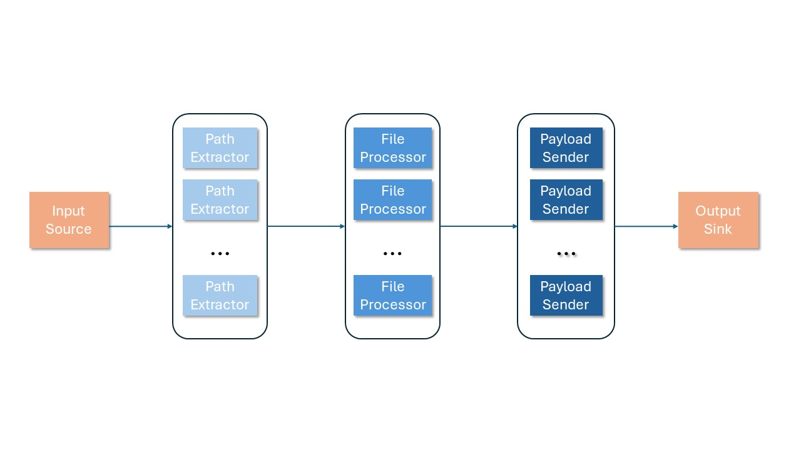

# How I Envisioned the Indexer/Crawler

First, let´s define what the Indexer does, in the simplest terms, the indexer must do three things:

1. It must get all the paths in a filesystem that corresponds to a valid email file, so, this stage needs a root directory that can be specified by the user and a way to traverse said directory, for the latter process, you can use the ```filepath.Walkdir()``` function that traverses the directory and can tell whether or not a file is a directory or not.
2. It must parse the mails in order to extract the relevant information, such as the normal headers (such as date, from, to, body...) and the X-headers. This process can take a long time, so we must find a way to exploit ```go's``` capabilities in concurrent processing in order to process multiple files in an async manner. This stage can also include the encoding of the processed files into a payload format that can be accepted by our database.
3. It must send all the encoded payloads into out database using the protocols that said database accepts, such as SQL queries or other methods. In this case, ZincSearch uses simple http requests for that.

So, first, I had a really simple crawler for processing the documents in this technical test, but the solution that I found was lacking, to say the least, the algorithm worked in the following manner.

1. It first got the path to the root directory from which it could perform a walk in the directory tree, classifying which files were not directories. Whenever we encounter a email, we increase a counter.
2. After encountering a file that is a valid email it created a separate goroutine that performed the processing just for that file. Here we can see that we are abusing the use of goroutines, because we spawn one separate goroutine for each separate file, so the number of goroutines grows as the file number increases. After the file is processed, the result is written into a separate file, let's call it an _auxiliary file_, this is another problem, because we are at the mercy of the operating system at this point.
3. To mitigate this, I used a counter variable that was increased each time we spin a new goroutine. When that counter arrived to a certain value, like 10,000 emails, it triggered a piece of code that told the program to wait for all the goroutines to finish writing. Then, sends the payload, flush the contents of the _auxiliary file_ and repeat.

As you can see, the first version of the crawler was really simple, but because of that, I was noticing a myriad of issues that plagued it. First, I wanted to increase the throughput of the crawler/indexer but that was not possible at the time due to the fact that I needed to wait for all the processor goroutines to finish in order to then send the file. As another related note, the crawler needed to write to a separate file in order to create the payload, this is not good due to the fact that accesing a file is slow, and using memory is a lot faster. So I had two main problems with my first algorithm.

1. I would like to not _wait_ for all the files to be processed in order to send _something_, ideally, I would like to send the payloads as they arrive and that if no payloads are available, _then_ I wait.
2. I would like to hold the processed files in memory, that could maybe increase the memory requirements, but it could also increase performance;  that seems critical when you're dealing with large amounts of data.

Aside from those concerns I also thought that the method for the processing was too tightly coupled to the application, such that it could need a total rewrite in the future (spoiler alert, it did), if the database or other external factor changed. So, I looked for alternatives that allowed me to architect some of the components of the indexer in a way that was more flexible. That ended up with me stumbling with a book by _Achilleas Anagnostopoulos_ called **Hands-On Software
Engineering with Golang**.

In that book, precisely in chapter 7, you learn to build a data processing pipeline from scratch, using only go primitives like channels and goroutines in order to create a pipeline that processes files or data (well, there´s a caveat, the pipeline shown is just the wrapper, you have to implement the logic for your use case youself, but it's a great start and totally recommend the textbook). So with that, I started to implement my own pipeline. I have included a diagram that illustrates how it works.



As you can see, the pipeline has a really simple design. It just consists of 5 relevant items, the source, three processing stages, and a sink. Each stage is connected to it's next stage by an input channel.

 The first stage is the input of the pipeline and feeds the data that the pipeline implementation needs to process. The second, third and fourth stages are _worker pools_ that use a set number of processors concurrently in order to process the data without regarding the order in which in arrives to the stage. What these processors do is explained in the next paragraphs. And finally, we have an output sink; that due to our usecase, just marks the payload as processed and discards it.

I'll try to explain how I implemented the pipeline in the following steps:

1. The pipeline needs an input to work, or in the lingo, _a source_, in our particular case, the source is a string slice that has the paths for every directory in the ```maildir``` directory. You can think of it as encoding the paths for all the users directories, with their inbox and sent emails, for example.
2. Then the input is passed to the first processing stage, the _**Path extractor**_ stage. This stage just classifies each file in each user directory whether a file is an email or not and gets the path to the email. All of the email paths are stored in another slice for further processing.
3. The resulting paths are passed to the second stage, the _**File Processor**_ stage. In this stage, each email is parsed, processed, formatted and aggregated into a payload that ZincSearch accepts. Because I used the ```_bulk``` api endpoint from ZincSearch, you need to encode all the emails into an ```.ndjson``` file.
4. Then, the payload is passed and sent by the third stage, the _**Payload Sender**_, in this stage, the payload is added as the body of an http request (with all the necessary headers) and sent to ZincSearch.
5. Finally, the sink just marks each payload as processed and discards it, this is performed in order to help the GC infer that we no longer need the memory allocated to the payload.
